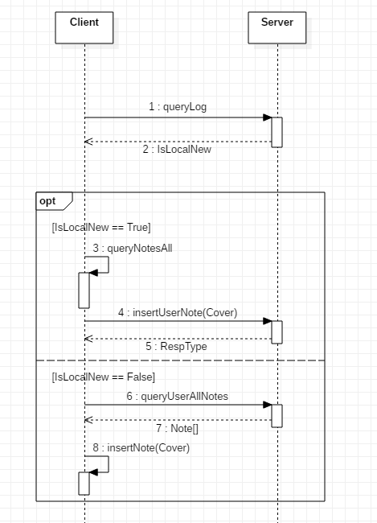

# DB

## 架构说明

+ 本地存储 <-> 服务器存储




## 服务器连接代码说明

+ 服务器
    + 正常操作 + Push 路由处理
    ```python
    def getStarsFromReqData(reqdata: str) -> [StarItem]:
        try:
            postjsons = json.loads(reqdata)
            ret = []
            for postjson in postjsons:
                 ret.append(checkJson(json.loads(postjson))) # 很奇怪这里转了一次还是 str     
        except:
            # 解析错误
            raise BodyRawJsonError()
        return ret
        
       
    def pushStar(username: str, stars: [StarItem]) -> bool:
        '''
        同步收藏
        '''
        starDao = StarDAO()
        rets = starDao.queryUserAllStars(username)
        for ret in rets:
            r = starDao.deleteUserStar(username, ret) # 全删
        
        for star in stars:
            r = starDao.insertUserStar(username, star) # 全插入
        
        return r
    ```
    
+ Net Util
    + 正常操作 + Push 路由处理
    ```java
    RespType resp = NetUtil.httpPostPutDeleteSync(
        PushStarUrl, NetUtil.POST,
        StarReqBody.toStarReqBodiesJson(StarReqBody.toStarReqBodies(searchItems)),
        NetUtil.getOneHeader("Authorization", AuthMgr.getInstance().getToken())
    );
    ```
    + 头处理
    ```java
    /**
     *SearchItemNetDao
     * @return
     */
    public static StarReqBody[] toStarReqBodies(SearchItem[] searchItems) {
        if (searchItems == null)
            return null;
        StarReqBody[] rets = new StarReqBody[searchItems.length];
        for (int i = 0; i < searchItems.length; i++)
            rets[i] = toStarReqBody(searchItems[i]);
        return rets;
    }

    /**
     *SearchItemNetDao
     * @return
     */
    public static String toStarReqBodiesJson(StarReqBody[] starReqBodies) {
        if (starReqBodies == null)
            return "";
        JSONArray jsonArray = new JSONArray();
        for (StarReqBody starReqBody : starReqBodies) {
            jsonArray.put(starReqBody.toJson());
        }
        return jsonArray.toString();
    }
    ```

## 数据修改代码说明

+ `ServerDbUpdateHelper`
    + `isLocalNewer` `isLocalOlder` 判断日志哪个新
    + `pullData` `pushData` 进行内容同步，使用整体替换方法 (服务器端对应 push 路由)
    + `pullLog` `pushLog` 进行日志更新

+ Dao
    + 在增删改查部分都加上 `if (isLogCheck) pushpull();`
    
    ```java
    private void updateLog() {
        UtLogDao utLogDao = new UtLogDao(context);
        utLogDao.updateLog(LogModule.Mod_Star);
    }
  
    private void pushpull() {
        if (AuthMgr.getInstance().isLogin())
            if (ServerDbUpdateHelper.isLocalNewer(context, LogModule.Mod_Star))
                ServerDbUpdateHelper.pushData(context, LogModule.Mod_Star);
            else if (ServerDbUpdateHelper.isLocalOlder(context, LogModule.Mod_Star))
                ServerDbUpdateHelper.pullData(context, LogModule.Mod_Star);
    }
    ```
    
    + 查：本地服务器同步 -> 本地查询
    + 增删改：本地服务器同步 -> 本地操作 -> 本地日志更新 -> 服务器操作 -> 服务器日志同步
    + 全删：本地操作 -> 本地日志更新 -> 本地服务器同步 -> 服务器日志同步
   
+ UI
    + 数据库访问全部使用新线程
    + 数据更新界面使用界面更新线程
    ```java
    SearchItemDao searchItemDao = new SearchItemDao(StarSearchItemActivity.this);
    new Thread(new Runnable() {
        @Override
        public void run() {
            ArrayList<SearchItem> s = searchItemDao.queryAllStarSearchItems();
            if (searchItemDao.deleteStarSearchItems(s) != -1) {
                runOnUiThread(new Runnable() {
                    @Override
                    public void run() {
                        Toast.makeText(StarSearchItemActivity.this, getString(R.string.SearchFrag_CancelAllStarSuccess), Toast.LENGTH_SHORT).show();
                        refreshListData();
                    }
                });
            }
            else
                runOnUiThread(new Runnable() {
                    @Override
                    public void run() {
                        Toast.makeText(StarSearchItemActivity.this, getString(R.string.SearchFrag_CancelAllStarFailed), Toast.LENGTH_SHORT).show();
                    }
                });
        }
    ```
    

## 笔记插入图片问题

+ 本地账户
    + 照样存储在本地 `biji/NoteImage`
    
+ 在线账户
    + 新建笔记上传过程: 上传图片 -> 返回新文件名 -> 修改笔记 `img` 标签 -> 上传笔记 -> 删除本地图片
    + 查看笔记下载过程: 返回笔记 -> 检查 img -> 直接显示网络图片 (暂时未使用缓存机制)

## 问题

+ 直接使用 `JsonArray` 的 `toString()` 方法和 `Python` 的 `json.loads()` 数据换行问题会报错
```java
public String toJson() {
    JSONObject obj = new JSONObject();
    try {
        obj.put("title", title);
        obj.put("url", url);
        obj.put("content", content); // 构造函数先使用 this.content = content.replaceAll("[\n|\r]", " ");
    }
    catch (JSONException ex) {
        ex.printStackTrace();
        return "";
    }
    return obj.toString();
}
```
